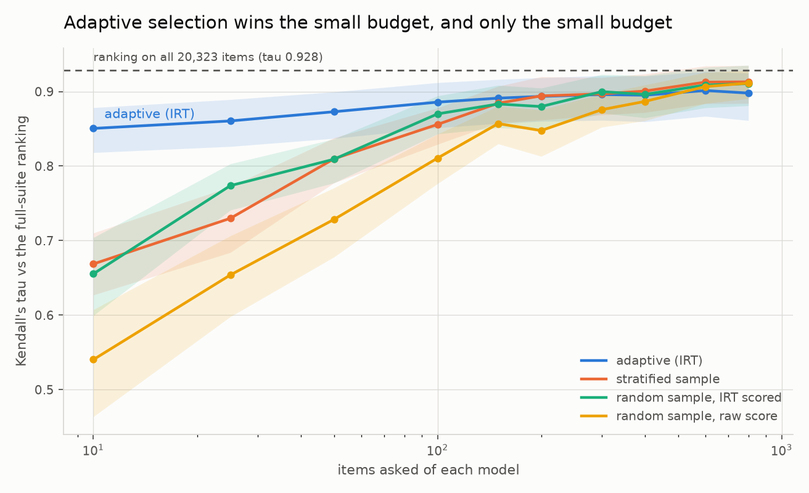

# Model Selection at a Tenth of the Cost

Answers "which AI model should we use, and did the new version get worse?" with statistical
confidence, using a fraction of the evaluation calls a full benchmark needs. For a team
re-evaluating models every month, that is a day instead of a week and tens of dollars instead
of thousands, and it names the benchmark questions that were never measuring anything.

Item response theory, the psychometrics behind every standardised test, fitted to a matrix of
150 language models by 20,365 benchmark items built from the public HELM per-item releases.
Calibrate the items once, then test each new model adaptively on the items that discriminate at
its level, and stop when the interval is tight enough to decide.

Then, because a result measured on one panel is a result about that panel, the whole method is
run again on a second bank built from a different source, a different harness and a different
kind of model: 400 open-weight submissions by 20,323 items from the Open LLM Leaderboard. It
replicates, and the two banks share 998 questions, which turns "item parameters may not
transfer" into a number. [Both are below.](#does-it-replicate-a-second-bank-from-a-different-source)

## Result

<!-- mselect:results:start -->
| Measure | Result |
|---|---|
| **Calls saved at the screening budget**: items an ordinary random sample needs to rank as well as 10 adaptive items | 127 items, **12.7 times** the adaptive budget (tau 0.778) |
| Kendall's tau against the full 18,921-item ranking, 10 adaptive items (0.05% of the suite) | **0.778** (95% CI 0.716 to 0.832); best baseline 0.559 (0.457 to 0.647) |
| Kendall's tau against the full 18,921-item ranking, 50 adaptive items (0.3% of the suite) | **0.845** (95% CI 0.790 to 0.892); best baseline 0.750 (0.672 to 0.819) |
| Kendall's tau against the full 18,921-item ranking, 200 adaptive items (1.1% of the suite) | **0.851** (95% CI 0.797 to 0.897); best baseline 0.892 (0.851 to 0.925) |
| Kendall's tau against the full 18,921-item ranking, 800 adaptive items (4.2% of the suite) | **0.870** (95% CI 0.820 to 0.909); best baseline 0.905 (0.870 to 0.936) |
| Ceiling on any ability-based ranking: the fit on all 18,921 items, against the suite average | tau 0.921 (ability and suite average are not the same construct) |
| Panel the ranking claim is measured on | 74 models x 18,921 items, 99.1% complete |
| Items needed to detect a 3-point accuracy drop at 80% power (mid-panel ability) | 118 items per model |
| Items needed to detect a 1-point drop at 80% power (mid-panel ability) | 3,559 items per model |
| Items whose discrimination is below 0.3, out of 20,365 | 4,262 (20.9%) |
| Items whose fitted slope is negative (the mis-keyed signature) | 1,757 (8.6%) |
| Items carrying no measurable information at mid-panel ability | 4,221 (20.7%) |
| Local dependence: item pairs with Q3 above 0.2 | 8% to 31% of pairs, depending on the benchmark |
| Dimensionality: correlation between per-benchmark abilities | 0.42 to 0.96 across benchmark pairs |
| Reliability: the same model answering the same item twice | 93.6% agreement (n = 5,500 repeated cells) |
| Differential item functioning, open weights vs API only | 128 items flagged (0.9%) |
| Test-retest: the same 500 items asked twice at temperature 0, a day apart | hosted models agree **0.936** (0.912 to 0.956) to 0.984 (0.972 to 0.994); the two on a laptop agree 0.998 and 1.000 |
| How much a benchmark score moves with nothing changed | **up to 2.0 points**, median 0.4, and symmetric (83 flips to right against 85 to wrong, p = 0.94), so it is a random walk rather than drift. A drop smaller than that is noise |
| Position bias and prompt-framing effects | _pending their own arms (PLAN.md section 4.3)_ |
| Does this bank rank models it was never fitted on? 11 current models, 2,830 items each, parameters read and not refitted | Kendall's tau **0.855** (0.617 to 1.000) |
| Adaptive items needed to rank those 11 models as well as all 2,830 do | **100 items** (3.5% of the suite), tau 0.855 (0.617 to 1.000) |
| Cost per ranking decision, in dollars | **US$0.72** against US$16.05 to ask every item, 4.5% |

Bank `v1` (`4a9871d69f3360d8`): 150 models x 20,365 items, 1,648,626 recorded responses from the public HELM per-item releases. Fitted with marginal maximum a posteriori by Bock-Aitkin EM, 61-point normal quadrature. Regenerate with `mselect report --version v1`.
<!-- mselect:results:end -->


More figures: [what the bank can measure, by ability](docs/figures/information.png), [item
parameters and the items that carry no information](docs/figures/item-parameters.png), [local
dependence by benchmark](docs/figures/local-dependence.png).

## The honest limitation

**Benchmark items are not independent, and that is measured here rather than assumed away.**
Between 8 and 31 percent of item pairs, depending on the benchmark, have a Q3 residual
correlation above 0.2: they share passages, templates, subjects and formats. Every standard
error from a fixed-length benchmark is therefore optimistic, including some of the ones in the
table above. The benchmarks also do not measure one single ability: per-benchmark abilities
correlate between 0.42 and 0.96, so the composite is a summary, not a measurement of one thing.
[docs/diagnostics.md](docs/diagnostics.md) reports both in full. The consequence is stated in
the unit that matters: on this bank a hundred MATH items carry about six items' worth of
independent evidence, a hundred MMLU items about forty-seven, and `mselect.dependence()` hands
that correction to anything importing the bank. **The second bank says the correction is not a
property of the benchmark alone**: MATH is the worst offender in both, but a hundred of its items
are worth about six on bank v1 and about eleven on bank v2. Take the correction from the bank you
are using, not from the benchmark's name.

**And the efficiency claim has a ceiling, which the table above shows rather than hides.**
Adaptive selection wins decisively where it matters for a screening decision: ten items rank the
panel as well as 127 randomly chosen ones, a 12.7 times saving. Above roughly 200 items it stops
winning and a plain random sample overtakes it. The reason is not a broken estimator, it is a
construct gap: the adaptive test converges on the bank's ability scale (Kendall's tau 0.92
against the ability fitted on all 18,921 items), while the thing a leaderboard reports is the
suite average, and those two rankings agree only at tau 0.92 even with every item in hand. If
you want the benchmark's own average, sample randomly and score it directly. If you want to know
which model is better, ask ten well-chosen questions.

**The own-run panel reproduces that ceiling on models the bank never saw, which is the version
of the result that counts.** Eleven current models from four vendors, 2,830 items each, asked
through this repository's own prompts and parser; the item parameters were read from the bank
and nothing was refitted. They rank at Kendall's tau 0.855, and 100 adaptively chosen items
reach that same 0.855 for US$0.72 against US$16.05 to ask everything. The ceiling is lower here
than on the public bank and the reason is the same construct gap, now measured twice: ability
and suite average are different quantities, and no number of items closes the distance between
them. Above 300 items a plain random sample overtakes adaptive selection again, at 0.945.

Three more limits worth stating before the method is used for anything:

- Every item is binary-scored, so this measures capability, knowledge and instruction
  following, not writing quality. Open-ended generation is out of scope by design.
- The calibration panel is 150 models evaluated by HELM between 2023 and 2025. Item parameters
  are on that panel's scale, and the second bank measures what that costs: over the 998 questions
  the two banks share, difficulty correlates 0.71 for the items that discriminate in both and
  not at all for the rest. Filter on discrimination before importing difficulty.
- The own-run validation is eleven models, not a hundred. It is the right eleven, spanning
  0.54 to 0.94 accuracy across four vendors and a laptop, but a bootstrap over eleven models
  is wide: every interval in that part of the table overlaps every other. What it settles is
  that the parameters transfer at all. What it cannot settle is a ranking of methods.
- `items_needed` is optimistic for large effects. Against the simulation it is well calibrated
  for small gaps and over-promises for big ones (88 percent predicted against 42 percent
  observed for models 5 to 10 points apart at ten items), because it assumes items are locally
  independent and they are not. Treat it as a floor. [PLAN.md](PLAN.md) section 13.6.

## Using it to choose a model

Everything above is a decision procedure rather than a leaderboard, so here is the shape of it
on a real shortlist and what each step costs.

**Ask what the decision needs, before spending anything.**

```python
import mselect
mselect.items_needed(3, 0.8, ability=0.0)   # 118 items per model, to catch a three point drop
mselect.items_needed(1, 0.8, ability=0.0)   # 3,559 items per model, for a one point drop
```

This is the step usually skipped, and it is where an evaluation budget goes. If the candidates
are about a point apart, no affordable test will separate them and the decision belongs to
price, latency or context window instead. Learning that before the first call is itself a
result. Treat the number as a floor, for the reason in the limitation above.

**Screen the shortlist at ten items each.** Ten adaptively chosen items rank a panel about as
well as 127 randomly chosen ones on bank v1 (tau 0.778, 95% CI 0.716 to 0.832) and 143 on bank
v2 (tau 0.851, 0.818 to 0.878). Five candidates is fifty calls, and the bottom of a shortlist
usually falls away at once.

**Resolve the survivors pairwise.** The last two are close by construction, so change the
stopping rule from "tight enough" to "decided", and keep asking until the intervals come apart.

```python
decision = mselect.separated(ability_a, ability_b)
decision.describe("candidate-a", "candidate-b")
# the shape of the answer, for example:
# candidate-a ahead after 34 items
# (candidate-a 0.71 [0.42, 0.99], candidate-b 0.18 [-0.11, 0.46])
```

**Take "not separated" as an answer too.** Overlapping intervals are reported as not separated
at this budget, never as the same. That outcome says the two models are indistinguishable for
what you were willing to spend, which is a decision result: stop paying for evaluations and
choose on cost.

The release-gate question, "did the new version get worse?", is the same procedure with the old
and new versions as the pair, plus one asymmetry. Failing to separate is not reassurance unless
the budget was large enough to find the drop you care about, which is what `items_needed` is
for. Not separated after 118 items means something. After twelve it means nothing.

Two things the bank hands a consumer that a benchmark score does not: `mselect.dependence()`
turns a count of items into the number of independent items they are worth, and the
[broken-item report](docs/items-that-measure-nothing.md) names the ones to drop before trusting
any difficulty at all.

### What runs today, and what does not

The loop above runs end to end against the 550 models already calibrated in the two banks, on
models held out of the fit, which is where every number in the tables comes from. Pointing it at
a model of your own choosing needs the one piece this repository does not have: something that
makes a vendor call. `mselect/runner/` holds what to ask, the option rotations, the answer
parsers and the scoring rules, tested against adversarial replies, and takes a `Caller` it is
handed; the caller goes through the portfolio gateway, project 04. That seam is deliberate, so
that none of the scoring logic needs a network, a key or a dollar to test. It is an adapter
rather than a rebuild, and it is the same gap the Status section names.

## Where the useless items are

One item in five in bank v1 discriminates below 0.3 and one in twelve has a negative slope,
which are two rows of the table above and the least interesting way to say it. The share is not
spread evenly, and which benchmark a reader uses decides whether any of this is about them.

<!-- mselect:benchmarks:start -->
| Benchmark | Items | Discrimination below 0.3 | Negative slope |
|---|---:|---:|---:|
| Massive Multitask Language Understanding | 13,937 | 18.6% | 7.2% |
| LegalBench | 2,047 | 53.0% | 27.2% |
| GSM8K (grade-school word problems) | 1,000 | 4.9% | 0.9% |
| MedQA (US medical licensing questions) | 1,000 | 20.1% | 7.1% |
| MMLU-Pro | 998 | 14.8% | 5.0% |
| OpenBookQA | 500 | 4.4% | 0.6% |
| GPQA (graduate-level Q&A) | 446 | 32.3% | 12.1% |
| MATH (competition mathematics) | 437 | 5.9% | 0.7% |
<!-- mselect:benchmarks:end -->

GSM8K, MATH and OpenBookQA are in good health by this measure. Over half of LegalBench's items,
as administered in HELM Lite, do not separate strong models from weak ones, and more than a
quarter run backwards, meaning stronger models get them wrong more often. A negative slope has
four possible causes, not equally interesting: a mis-keyed answer, an ambiguous question where
the better model sees the ambiguity, a grader marking a correct answer wrong, and genuine
inverse scaling. Telling them apart needs the item text and a human, which is why nothing here
is named as mis-keyed. But it takes one fit to produce the list, and if you own a benchmark it
is where to look first.

[**Your benchmark is measuring fewer things than you think**](docs/writeup.md) is the write-up
of what fell out of this: the five findings in full, the empirical curves of the worst items,
and what to do about each on Monday, including the two audiences this README does not otherwise
address. If you own a benchmark, fit a 2PL to the per-item results you already have and read the
bottom of the discrimination list; the dead items are free to find and cost you money every run.
If you publish an evaluation number, publish a Q3 and a dimensionality check beside it, because
both are cheap and both change how the interval should be read.

## Does it replicate? A second bank, from a different source

Everything above is one item bank: 150 models, mostly frontier APIs, scored by HELM. A result
measured once on one panel is a result about that panel. So the whole method was run again on a
bank with almost nothing in common with the first.

Bank `v2` is **400 open-weight submissions to the Open LLM Leaderboard by 20,323 items, 99.8
percent complete** - where bank v1 is 54 percent observed and its headline has to be measured on
a nearly-complete block peeled out of it. The panel is drawn ten from each of forty equal-width
bands of the leaderboard average, so it spans the range from near-chance to the top of the
open-weight field instead of clustering where the submissions do, and it is capped at eight
models per hub organisation because forty merges of one base model are close to one model
repeated. The selection is mechanical and seeded, so the panel is whatever those two rules
returned: model names are as their authors published them on the hub, and none were dropped or
kept on the strength of what they are called. It covers BIG-Bench Hard, MMLU-Pro, MuSR, MATH at level 5 and GPQA, and where bank v1
reads the model's stated final answer after chain-of-thought, this one takes the
highest-likelihood option.

<!-- mselect:results:v2:start -->
| Measure | Result |
|---|---|
| **Calls saved at the screening budget**: items an ordinary random sample needs to rank as well as 10 adaptive items | 143 items, **14.3 times** the adaptive budget (tau 0.851) |
| Kendall's tau against the full 20,323-item ranking, 10 adaptive items (0.05% of the suite) | **0.851** (95% CI 0.818 to 0.878); best baseline 0.669 (0.627 to 0.710) |
| Kendall's tau against the full 20,323-item ranking, 50 adaptive items (0.2% of the suite) | **0.873** (95% CI 0.837 to 0.900); best baseline 0.810 (0.777 to 0.838) |
| Kendall's tau against the full 20,323-item ranking, 200 adaptive items (1.0% of the suite) | **0.893** (95% CI 0.860 to 0.919); best baseline 0.894 (0.862 to 0.920) |
| Kendall's tau against the full 20,323-item ranking, 800 adaptive items (3.9% of the suite) | **0.898** (95% CI 0.861 to 0.925); best baseline 0.913 (0.884 to 0.935) |
| Ceiling on any ability-based ranking: the fit on all 20,323 items, against the suite average | tau 0.928 (ability and suite average are not the same construct) |
| Panel the ranking claim is measured on | 150 models held out of 400 x 20,323 items, 99.8% complete |
| Items needed to detect a 3-point accuracy drop at 80% power (mid-panel ability) | 90 items per model |
| Items needed to detect a 1-point drop at 80% power (mid-panel ability) | 2,100 items per model |
| Items whose discrimination is below 0.3, out of 20,323 | 8,070 (39.7%) |
| Items whose fitted slope is negative (the mis-keyed signature) | 4,004 (19.7%) |
| Items carrying no measurable information at mid-panel ability | 7,102 (34.9%) |
| Local dependence: item pairs with Q3 above 0.2 | 3% to 15% of pairs, depending on the benchmark |
| Dimensionality: correlation between per-benchmark abilities | 0.26 to 0.98 across benchmark pairs |
| Reliability: the same model answering the same item twice | no repeated administrations in this bank, so no figure |
| Differential item functioning, merged models vs models trained directly, at matched ability | 1,449 items flagged (7.3%) |
| Differential item functioning, open weights vs API only | not measurable on this panel |
| Do these item parameters mean anything on bank `v1`? All 998 shared items | difficulty correlates -0.04 (-0.10 to 0.02) |
| The same, over the 532 shared items that discriminate above 0.3 in both banks | difficulty correlates **0.71** (0.67 to 0.75) |
| Test-retest reliability | _pending their own arms (PLAN.md section 4.3)_ |
| Position bias and prompt-framing effects | _pending their own arms (PLAN.md section 4.3)_ |
| Cost per ranking decision, in dollars | _pending the own-run panel (run `mselect run` then `mselect validate`)_ |

Bank `v2` (`b66652e06b8acf5d`): 400 models x 20,323 items, 8,114,706 recorded responses from the Open LLM Leaderboard v2 per-item details. Fitted with marginal maximum a posteriori by Bock-Aitkin EM, 61-point normal quadrature. Regenerate with `mselect report --version v2`.
<!-- mselect:results:v2:end -->

Where the useless items are in this bank, on the same aggregation as v1 above:

<!-- mselect:benchmarks:v2:start -->
| Benchmark | Items | Discrimination below 0.3 | Negative slope |
|---|---:|---:|---:|
| MMLU-Pro | 12,034 | 39.1% | 19.8% |
| BIG-Bench Hard | 5,761 | 39.8% | 19.2% |
| MATH level 5 (the hardest competition problems) | 1,324 | 15.0% | 1.0% |
| MuSR (multistep soft reasoning) | 756 | 70.8% | 40.9% |
| GPQA (graduate-level Q&A) | 448 | 76.6% | 44.4% |
<!-- mselect:benchmarks:v2:end -->

GPQA is 32.3% dead on bank v1 and 76.6% here, which is the bank-dependence point again rather
than a contradiction. Discrimination is measured against a panel, and a question almost none of
this panel can answer separates nobody: most of these 400 open-weight submissions sit near
chance on GPQA, so the item has no one left to tell apart. Read a share in this table as a
statement about the benchmark and the panel together, never about the benchmark alone.



**The shape of the result replicates and the ceiling replicates almost exactly.** Ten adaptive
items rank this panel as well as 143 randomly chosen ones, against 127 on bank v1. Adaptive
selection is decisively ahead up to about a hundred items and the baselines pass it above two
hundred, as before. And the construct gap that causes it is the same size in both banks: ability
fitted on every item agrees with the suite average at tau 0.928 here and 0.921 there, so the
ceiling on any ability-based ranking is a property of the two measurements, not of one dataset.

More on this bank: [its diagnostics in full](docs/diagnostics-v2.md), [its broken
items](docs/items-that-measure-nothing-v2.md), [what it can measure by
ability](docs/figures/information-v2.png), [its item
parameters](docs/figures/item-parameters-v2.png), [its local
dependence](docs/figures/local-dependence-v2.png).

### The same 998 questions, calibrated twice

Every MMLU-Pro item HELM sampled is among the 12,032 the leaderboard runs. So the same questions
are calibrated on panels with no models in common, through harnesses that score them differently,
and "a bank calibrated on a different panel is a different bank" stops being a caveat and becomes
a measurement. The pairing is on MMLU-Pro's own question id, which both sources keep, and it was
checked against the question text itself before the excerpts were removed from the bank: all 998
matched.

| Items compared | Difficulty correlation | One bank's hardest tenth, recovered by the other |
|---|---|---|
| All 998 shared items | **-0.04** (-0.10 to 0.02) | 14.1% (7.6 to 21.7) |
| The 532 that discriminate above 0.3 in both banks | **+0.71** (0.67 to 0.75) | 49.1% (34.0 to 60.4) |

The first row reads as "item parameters do not transfer at all", and it is arithmetic rather
than psychometrics: difficulty is `-d/a`, so an item whose slope is indistinguishable from zero
has a difficulty that is a division and not a measurement, and the unfiltered correlation is
dominated by those. The second row is what a consumer gets who drops the items that measure
nothing first.

Which makes [the broken-item report](docs/items-that-measure-nothing.md) a prerequisite for using
an item bank rather than a curiosity, and gives project 03 a rule rather than a warning: **filter
on discrimination before importing difficulty.** Even then the two banks agree about half the
time on which items are in the hardest tenth, so item parameters are portable enough to rank
items and not portable enough to use as constants.

`mselect crossbank` regenerates the table.

## What it does

- **Calibrates the bank.** A 2PL and a 3PL fit by marginal maximum likelihood over the whole
  matrix, with standard errors on every parameter, item fit statistics, and the answer-key and
  contamination checks.
- **Finds the items that measure nothing.** One item in five discriminates below 0.3, and one
  in twelve has a negative slope, meaning stronger models get it wrong more often.
  [docs/items-that-measure-nothing.md](docs/items-that-measure-nothing.md) lists them with
  evidence.
- **Tests adaptively.** Maximum Fisher information selection with content balancing across
  benchmarks, expected a posteriori ability estimation, and two stopping rules: a target
  precision, and "these two models are now separated".
- **Says how many items you need.** `items_needed(effect, power, ability)` turns "detect a
  three-point regression" into a number of items, derived from the bank's information function
  and checked against the simulation.
- **Checks whether any of it transfers.** Two banks, 998 shared questions, one number for
  whether difficulty calibrated on one panel means anything on another. It does, for the items
  that measure something, and not at all for the rest.
- **Hands the result to the next project.** `import mselect` gives the power function, the frozen
  banks, the adaptive estimator, the reliability figure and the local-dependence correction, with
  the caveats attached rather than left in a document. [CHANGELOG.md](CHANGELOG.md) says what
  v0.2.0 contains and, as plainly, what it does not.

## Reproduce it

```bash
uv sync
uv run mselect bank fetch     # ~320 MB of public HELM per-item results, cached forever
uv run mselect bank build     # freeze the versioned, content-hashed item bank
uv run mselect fit            # 2PL item parameters, about a minute
uv run mselect diagnose       # fit statistics, Q3, dimensionality, DIF
uv run mselect simulate       # leave-one-model-out adaptive simulation vs the baselines
uv run mselect report         # regenerate the table above, the documents and the figures
```

And the second bank, which needs a free Hugging Face read token in `HF_TOKEN` because the
leaderboard's per-item datasets are gated. A token is the whole gate: no access request is filed
and nothing is written to the account it belongs to.

```bash
uv run mselect bank panel                        # choose 400 models and prove they are readable
uv run mselect bank fetch-ollm                   # about 1 GB, one column of each file at a time
uv run mselect bank build --source ollm --version v2
uv run mselect fit --version v2                  # then diagnose, simulate --evaluate 150, report
uv run mselect crossbank                         # do the two banks agree about the same items?
```

Nothing in either list costs money. The HELM public buckets need no account at all, and every
byte fetched from either source is cached with the date it was fetched, the URL it came from and
the size of the file it was taken from.

## Status

Built out of its November slot, ahead of schedule, and nearly finished.

**Measured from public per-item data**: everything in both tables above, on two independent
banks, at no cost to anyone.

**Measured by running current models here**: the transfer result and the dollar cost per
ranking decision. The panel is eleven models across Anthropic, OpenAI, Google, an open-weights
host and two small models on a laptop, administered the committed 3,000-item suite on 2026-09-12
and 2026-09-13 for US$18.25 through the portfolio gateway, which enforces the spend caps and
records every call. `mselect validate` reads the records back and costs nothing to repeat.

**Not measured yet**: the three measurement experiments of [PLAN.md](PLAN.md) section 4.3,
test-retest, position bias and prompt framing. Their analyses are written and tested against
fixtures; what they need is four more arms of roughly US$10, not more design.

A vendor call is possible from this repository now, and it is gated. `mselect run` and
`mselect smoke` are the only commands that can spend, both refuse to send anything without an
explicit `--yes`, and both print what they would ask first. Every other command reads what is
already recorded.

## How it is built

`mselect` is a typed Python package: `data/` fetches and freezes the bank, `irt/` fits and
diagnoses it, `cat/` runs the adaptive test and the simulation, `power.py` is the interface
project 03 imports, `report/` writes everything in this README. `ruff` and `mypy --strict` are
clean and the tests fail meaningfully: parameter recovery on simulated matrices, adaptive
estimator convergence, planted local dependence and planted differential item functioning both
detected, and answer parsers against adversarial fixtures.

The same checks run before the commit, not after the push. `.githooks/pre-commit` runs
`ruff format --check`, `ruff check` and `mypy --strict`, about five seconds together, and
`.githooks/pre-push` runs the test suite. Turn them on once per clone:

```bash
git config core.hooksPath .githooks
```

- [PLAN.md](PLAN.md): the plan this was built against, and the places reality changed it.
- [docs/data-sources.md](docs/data-sources.md): what was verified about the public sources, and
  what turned out to be gated.
- [docs/items-that-measure-nothing.md](docs/items-that-measure-nothing.md): the broken-item report.
- [docs/diagnostics.md](docs/diagnostics.md): local dependence, dimensionality and DIF in full.
- [docs/rejected.md](docs/rejected.md): two approaches tried and rejected, with the evidence.
  One was this project's own headline assumption. The other would have corrupted an item bank
  silently rather than loudly, which is the more useful failure.
- [docs/writeup.md](docs/writeup.md): the practitioner write-up, "your benchmark is measuring
  fewer things than you think".

## Licence, and what is redistributed

The code is [MIT licensed](LICENSE). **No benchmark text is in this repository**: not a question,
not an answer, not an excerpt. The bank stores a content hash of each item, the source's own
instance id and the benchmark it came from, which is enough to reproduce every number here and
enough to look any item up at its source, without carrying a line of anyone else's benchmark.
What is redistributed is measurements, which model answered which item correctly, from two
openly published evaluation projects. [docs/data-sources.md](docs/data-sources.md) names the
sources, what was taken and the terms.

## Part of a portfolio

This project supplies the statistical core of the AI Release Gate, which uses its item bank and
its power function to say how many eval items a regression test actually needs.

## How this was built

Design, methodology, evaluation choices and judgement are Peter Parker's. AI coding assistants
(Claude Code) were used for implementation and drafting, the way a senior engineer uses them in
2026. Every number in the results table is reproducible from this repository with one command,
and that reproducibility is the evidence that matters.
