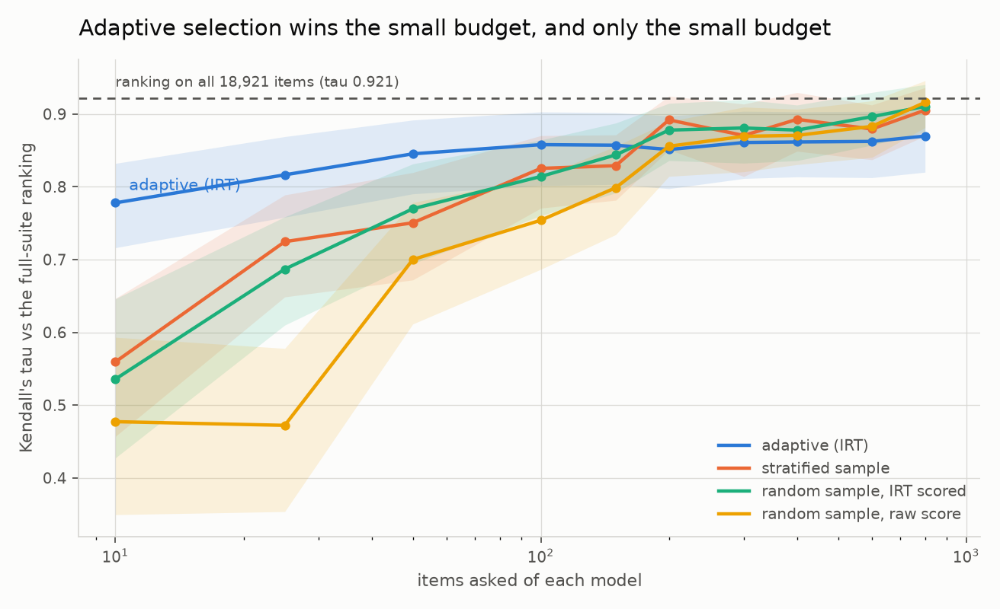

# Model Selection at a Tenth of the Cost

Answers "which AI model should we use, and did the new version get worse?" with statistical
confidence, using a fraction of the evaluation calls a full benchmark needs. For a team
re-evaluating models every month, that is a day instead of a week and tens of dollars instead
of thousands, and it names the benchmark questions that were never measuring anything.

Item response theory, the psychometrics behind every standardised test, fitted to a matrix of
150 language models by 20,365 benchmark items built from the public HELM per-item releases.
Calibrate the items once, then test each new model adaptively on the items that discriminate at
its level, and stop when the interval is tight enough to decide.

## Result

<!-- mselect:results:start -->
| Measure | Result |
|---|---|
| **Calls saved at the screening budget**: items an ordinary random sample needs to rank as well as 10 adaptive items | 127 items, **12.7 times** the adaptive budget (tau 0.778) |
| Kendall's tau against the full 18,921-item ranking, 10 adaptive items (0.1% of the suite) | **0.778** (95% CI 0.716 to 0.832); best baseline 0.559 (0.457 to 0.647) |
| Kendall's tau against the full 18,921-item ranking, 50 adaptive items (0.3% of the suite) | **0.845** (95% CI 0.790 to 0.892); best baseline 0.750 (0.672 to 0.819) |
| Kendall's tau against the full 18,921-item ranking, 200 adaptive items (1.1% of the suite) | **0.851** (95% CI 0.797 to 0.897); best baseline 0.892 (0.851 to 0.925) |
| Kendall's tau against the full 18,921-item ranking, 800 adaptive items (4.2% of the suite) | **0.870** (95% CI 0.820 to 0.909); best baseline 0.905 (0.870 to 0.936) |
| Ceiling on any ability-based ranking: the fit on all 18,921 items, against the suite average | tau 0.921 (ability and suite average are not the same construct) |
| Panel the ranking claim is measured on | 74 models x 18,921 items, 99.1% complete |
| Items needed to detect a 3-point accuracy drop at 80% power (mid-panel ability) | 118 items per model |
| Items needed to detect a 1-point drop at 80% power (mid-panel ability) | 3,559 items per model |
| Items whose discrimination is below 0.3, out of 20,365 | 4,262 (20.9%) |
| Items whose fitted slope is negative (the mis-keyed signature) | 1,757 (8.6%) |
| Items carrying no measurable information at mid-panel ability | 4,221 (20.7%) |
| Local dependence: item pairs with Q3 above 0.2 | 8% to 31% of pairs, depending on the benchmark |
| Dimensionality: correlation between per-benchmark abilities | 0.42 to 0.96 across benchmark pairs |
| Reliability: the same model answering the same item twice | 95.3% agreement (n = 8,431 repeated cells) |
| Differential item functioning, open weights vs API only | 128 items flagged (0.9%) |
| Position bias and prompt-framing effects | _pending the own-run panel (needs the gateway's batch support; see PLAN.md section 3.3)_ |
| Cost per ranking decision, in dollars | _pending the own-run panel (needs the gateway's batch support; see PLAN.md section 3.3)_ |

Bank `v1` (`1d4c357935c70875`): 150 models x 20,365 items, 1,648,626 recorded responses from the public HELM per-item releases. Fitted with marginal maximum a posteriori by Bock-Aitkin EM, 61-point normal quadrature. Regenerate with `mselect report --version v1`.
<!-- mselect:results:end -->



More figures: [what the bank can measure, by ability](docs/figures/information.png), [item
parameters and the items that carry no information](docs/figures/item-parameters.png), [local
dependence by benchmark](docs/figures/local-dependence.png).

## The honest limitation

**Benchmark items are not independent, and that is measured here rather than assumed away.**
Between 8 and 31 percent of item pairs, depending on the benchmark, have a Q3 residual
correlation above 0.2: they share passages, templates, subjects and formats. Every standard
error from a fixed-length benchmark is therefore optimistic, including some of the ones in the
table above. The benchmarks also do not measure one single ability: per-benchmark abilities
correlate between 0.42 and 0.96, so the composite is a summary, not a measurement of one thing.
[docs/diagnostics.md](docs/diagnostics.md) reports both in full. The consequence is stated in
the unit that matters: on this bank a hundred MATH items carry about six items' worth of
independent evidence, a hundred MMLU items about forty-seven, and `mselect.dependence()` hands
that correction to anything importing the bank.

**And the efficiency claim has a ceiling, which the table above shows rather than hides.**
Adaptive selection wins decisively where it matters for a screening decision: ten items rank the
panel as well as 127 randomly chosen ones, a 12.7 times saving. Above roughly 200 items it stops
winning and a plain random sample overtakes it. The reason is not a broken estimator, it is a
construct gap: the adaptive test converges on the bank's ability scale (Kendall's tau 0.92
against the ability fitted on all 18,921 items), while the thing a leaderboard reports is the
suite average, and those two rankings agree only at tau 0.92 even with every item in hand. If
you want the benchmark's own average, sample randomly and score it directly. If you want to know
which model is better, ask ten well-chosen questions.

Three more limits worth stating before the method is used for anything:

- Every item is binary-scored, so this measures capability, knowledge and instruction
  following, not writing quality. Open-ended generation is out of scope by design.
- The calibration panel is 150 models evaluated by HELM between 2023 and 2025. Item parameters
  are on that panel's scale; a bank calibrated on a different panel is a different bank.
- The own-run validation on current models has not happened yet (see Status).
- `items_needed` is optimistic for large effects. Against the simulation it is well calibrated
  for small gaps and over-promises for big ones (88 percent predicted against 42 percent
  observed for models 5 to 10 points apart at ten items), because it assumes items are locally
  independent and they are not. Treat it as a floor. [PLAN.md](PLAN.md) section 13.6.

## What it does

- **Calibrates the bank.** A 2PL and a 3PL fit by marginal maximum likelihood over the whole
  matrix, with standard errors on every parameter, item fit statistics, and the answer-key and
  contamination checks.
- **Finds the items that measure nothing.** One item in five discriminates below 0.3, and one
  in twelve has a negative slope, meaning stronger models get it wrong more often.
  [docs/items-that-measure-nothing.md](docs/items-that-measure-nothing.md) lists them with
  evidence.
- **Tests adaptively.** Maximum Fisher information selection with content balancing across
  benchmarks, expected a posteriori ability estimation, and two stopping rules: a target
  precision, and "these two models are now separated".
- **Says how many items you need.** `items_needed(effect, power, ability)` turns "detect a
  three-point regression" into a number of items, derived from the bank's information function
  and checked against the simulation.
- **Hands the result to the next project.** `import mselect` gives the power function, the frozen
  bank, the adaptive estimator, the reliability figure and the local-dependence correction, with
  the caveats attached rather than left in a document. [CHANGELOG.md](CHANGELOG.md) says what
  v0.1.0 contains and, as plainly, what it does not.

## Reproduce it

```bash
uv sync
uv run mselect bank fetch     # ~320 MB of public HELM per-item results, cached forever
uv run mselect bank build     # freeze the versioned, content-hashed item bank
uv run mselect fit            # 2PL item parameters, about a minute
uv run mselect diagnose       # fit statistics, Q3, dimensionality, DIF
uv run mselect simulate       # leave-one-model-out adaptive simulation vs the baselines
uv run mselect report         # regenerate the table above, the documents and the figures
```

Nothing in that list costs money. The public per-item results come from the HELM public
buckets, which need no account and no token, and every byte fetched is cached with its SHA-256
and the date it was fetched.

## Status

Built out of its November slot, ahead of schedule, and not finished. What is measured:
everything in the table above, from public per-item data. What is not: the own-run panel of
current models (test-retest, position bias, prompt framing, and the dollar cost per ranking
decision), which needs vendor calls through the portfolio gateway's batch support. The plan for
that half is [PLAN.md](PLAN.md) section 3.3, and the schedule change is recorded in
[PLAN.md](PLAN.md) section 13. Everything about that half that can be settled without spending
anything is settled: the prompts, the option rotations, the panel, the answer parsers and the
three experiment analyses are written and tested against fixtures, so when the runner is wired
up there is nothing left to decide. Nothing in this repository can make a vendor call.

## How it is built

`mselect` is a typed Python package: `data/` fetches and freezes the bank, `irt/` fits and
diagnoses it, `cat/` runs the adaptive test and the simulation, `power.py` is the interface
project 03 imports, `report/` writes everything in this README. `ruff` and `mypy --strict` are
clean and the tests fail meaningfully: parameter recovery on simulated matrices, adaptive
estimator convergence, planted local dependence and planted differential item functioning both
detected, and answer parsers against adversarial fixtures.

- [PLAN.md](PLAN.md): the plan this was built against, and the places reality changed it.
- [docs/data-sources.md](docs/data-sources.md): what was verified about the public sources, and
  what turned out to be gated.
- [docs/items-that-measure-nothing.md](docs/items-that-measure-nothing.md): the broken-item report.
- [docs/diagnostics.md](docs/diagnostics.md): local dependence, dimensionality and DIF in full.
- [docs/rejected.md](docs/rejected.md): an approach tried and rejected, with the evidence.
- [docs/writeup.md](docs/writeup.md): the practitioner write-up, "your benchmark is measuring
  fewer things than you think".

## Part of a portfolio

One of fifteen projects built over twelve months. This one supplies the statistical core of the
AI Release Gate, which uses its item bank and its power function to say how many eval items a
regression test actually needs.

## How this was built

Design, methodology, evaluation choices and judgement are Peter Parker's. AI coding assistants
(Claude Code) were used for implementation and drafting, the way a senior engineer uses them in
2026. Every number in the results table is reproducible from this repository with one command,
and that reproducibility is the evidence that matters.
